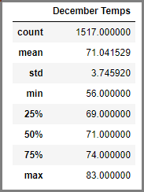
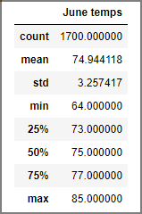

# surfs_up

For this part of the Challenge, write a report that describes the key differences in weather between June and December and two recommendations for further analysis.

### Project Overview
Since my vacation in Hawaii last year, I've been working on a business plan to open a Surf and Shake shop, serving up ice cream and surfboards. I have a small savings but will need the backing of a real investor to get the plan off the ground. I reached out to an investor named W. Avy whom has a real love for surfing as well. His only concern is the weather and asked me to do analyses on the year round temperatures to make sure this is a sustainable business model. I have already provided him with the analysis of precipitation data, now he has asked me to do further analysis on temperatures and has me to provide summary statistics of temperatures for the months of June and December.

### Resources
- Date Source: hawaii.sqlite
- Software: Python 3.7.6, Jupyter Notebook, Atom 1.63.1

### Results
Below are the results of the summary statistics performed on June and December temperatures based on data gathered over six years.

- Temperature collection counts are not equal for June and December. June has 1700 points of data collected, and December only has 1517 points.
- The average high temperature for December is 71.0°F while June's high is 74.9°F.
- The lowest high temperature for December was 56.0°F and June's was 64°F.

### Summary
Overall, you will notice that Hawaii has a pretty consistent temperature year round. At the surface level it seems as though a surf and ice cream shake is a very viable business model. The highest max temperatures year round are very similar being 83°F and 85°F and the standard deviation for both December and June is 3.74 and 3.25°F. There are a couple of more queries that could be used as well. I would also like to pull a query that has both the precipitation and temperature in order to see if there is a correlation between the daily temperature and precipitation level. Another query that I would preform analyses on all of the individual stations that are reporting and actually compare the location of the station to the temperatures and precipitation levels. For example if we are looking at data that is being pulled from inland, it isn't relevant to the temperature and precipitation data of a station that is located closer to the coast.
